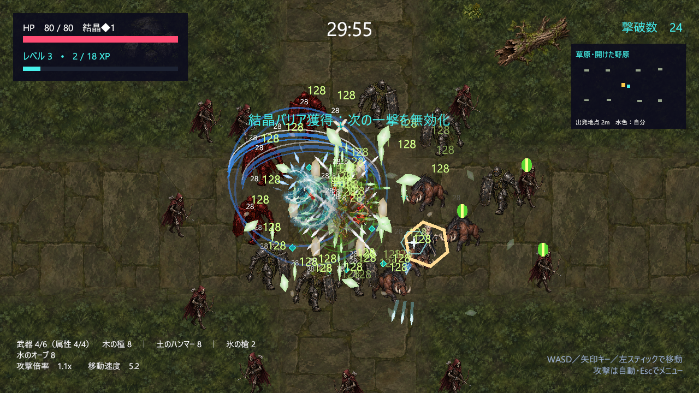
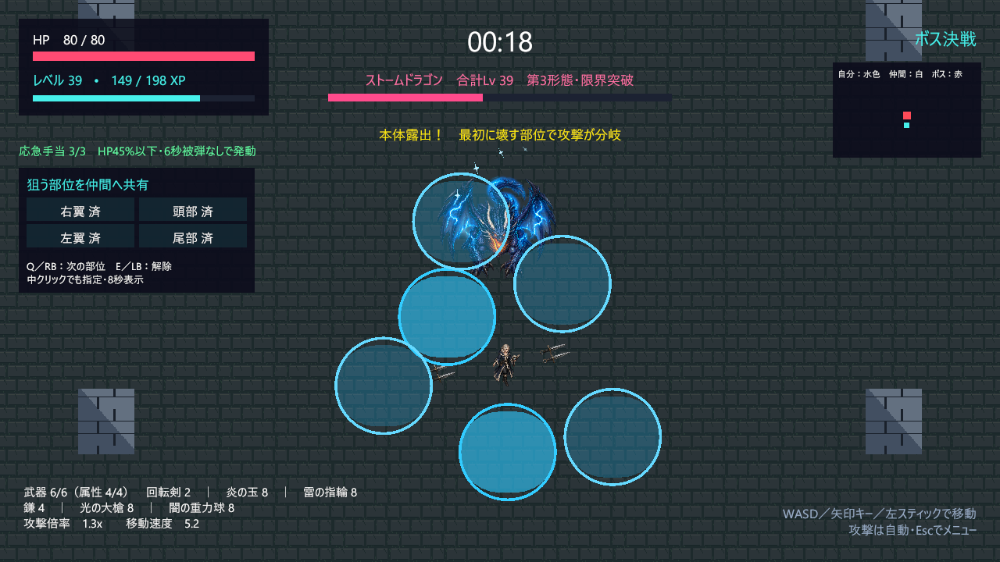
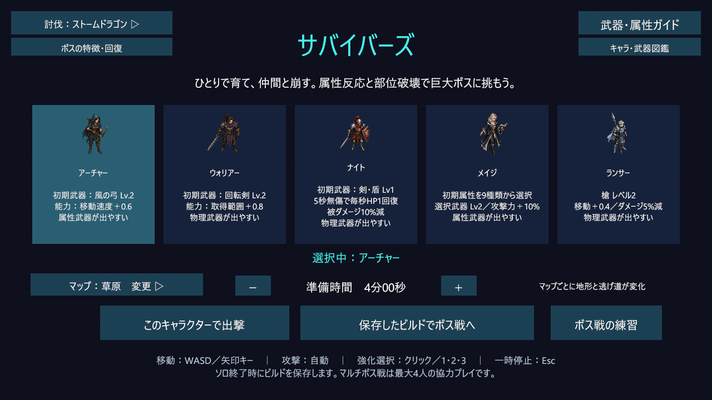

# Elemix

**ソロで育てた武器構成を持ち寄り、属性反応と部位破壊で巨大ボスに挑む2D協力ローグライト。**

Unity / C#で開発しているゲームです。原神の元素反応のように、攻撃を組み合わせる楽しさをローグライクのビルド作りに取り入れたいと考えて制作しました。ソロで武器を育てた後は、その構成で仲間とボスに挑みます。ゲーム内の表示は日本語です。

[設計・実装の見どころ](docs/ARCHITECTURE.md) · [起動・操作方法](docs/GETTING_STARTED.md) · [検証結果](docs/属性反応と物理の火力・手応え.md) · [資料一覧](docs/README.md)

*Windows開発版のソロ戦闘。画面は動作確認用の装備・敵配置で撮影しています。*

## どんなゲームか

1. **選ぶ** — 5人のキャラクターから選択。メイジは最初の属性も選べます。
2. **育てる** — 草原・遺跡で敵を倒し、レベルアップの3択で武器を強化。準備時間を変更できます。
3. **持ち寄る** — 育てたビルド（武器・レベル・能力の組み合わせ）を保存し、同じ部屋コードで合流します。
4. **攻略する** — 最大4人のボス戦へ。部位指定ピンで狙いを共有し、装甲を壊して本体を攻撃します。オフラインの練習も可能です。

## 制作の背景と、こだわったこと

### 属性を組み合わせる楽しさを、毎回違うビルドで味わう

制作で一番意識したのは、既存のゲームとの差別化です。Vampire Survivorsのような育成に、原神で面白いと感じた「属性を組み合わせて大きなダメージを出す楽しさ」を入れたいと思いました。レベルアップの3択でも、今強い武器だけでなく「次にこの属性を取れたら、こんな反応ができる」と考えられるようにしています。

属性反応を入れるだけで終わらず、育てたビルドの使い道として部位破壊のある協力ボス戦を作りました。自分の装備と仲間の装備、先に壊す部位によって戦い方が変わるところを、このゲームの特徴にしたいと考えています。

物理武器も選ぶ楽しさが残るよう、2本を1本に合体させる進化を用意しました。属性は反応の組み合わせ、物理は合体と装甲への強さを活かす構成です。

- **属性の連鎖**：木＋水で開花し、雷で超開花、炎で烈開花へ派生。拡散は付着を残して次の反応を助けます。
- **物理武器の合体**：素材2本を1本にまとめて枠を空ける仕組み。物理12種すべてに合体先があり、10通りの組み合わせを実装しています。
- **壊すほど変化するボス**：部位の破壊順で攻撃が分岐。最初の部位破壊で第2形態、本体HP50%で第3形態へ移り、外見と攻撃を変更します。
- **協力の合図と攻撃機会**：部位ピンで狙いを共有。部位破壊後のひるみと短時間の弱点を利用できます。

*ボスの形態・攻撃を確認するための単独撮影です。4人接続の実証画像ではありません。*

## 実装規模と技術

| 項目 | 現在の内容 |
|---|---|
| エンジン / 言語 | Unity 6 **6000.0.43f1** / C# |
| 描画 / 入力 | 2D URP **17.0.4** / Input System **1.13.1** |
| 通信 | Photon Fusion **2.0.5** / Shared Mode |
| 主な対象環境 | Windows 64bit |
| 育成 | 5キャラクター、物理12種・属性9種、物理合体10通り |
| 戦場 | ソロ2マップ・各3区画、敵5種、ボス4種×3形態 |
| ゲーム進行 | ホーム → ソロ育成 → ロビー → 協力ボス戦 |

武器は合計6枠・属性は最大4つ。死亡時は直近3回の強化を失って復活します。具体的なルールは[ゲームガイド](Assets/RogueSurvivors/README.ja.md)を参照してください。

## 設計・実装で工夫したこと

反応やボスの種類を追加しても追いかけやすいように、判定・状態の更新・見た目の処理を分けています。また、遊んで気になった点を直す際は、数値を変更するだけでなく、その問題が起きる条件を確認できる検証処理も用意しています。

| 課題 | 実装上の工夫 | 読み始める場所 |
|---|---|---|
| 反応・継続ダメージ・表示が複雑になる | 付着と反応判定、継続効果、開花の追撃、演出を分離 | [ElementReaction.cs](Assets/RogueSurvivors/Scripts/ElementReaction.cs) / [ReactionDamage.cs](Assets/RogueSurvivors/Scripts/ReactionDamage.cs) |
| 敵を倒すと開花の種まで消えてしまう | 追撃を敵と別のオブジェクトで実行し、撃破後も一度だけ発動 | [BloomBurst.cs](Assets/RogueSurvivors/Scripts/BloomBurst.cs) |
| 部位破壊を攻略判断にしたい | 部位残量・破壊順と攻撃の選択を分けて管理 | [BossParts.cs](Assets/RogueSurvivors/Scripts/BossParts.cs) / [BossAttackDirector.cs](Assets/RogueSurvivors/Scripts/BossAttackDirector.cs) |
| 複数クライアントでボス状態を揃える | 状態の管理権限を持つクライアントがダメージを処理し、HP・部位・形態を同期 | [NetworkEnemySync.cs](Assets/RogueSurvivors/Scripts/NetworkEnemySync.cs) |
| 感覚だけで武器の強さを決めない | 強化条件を揃えた火力比較と、実際の敵生成を使った自動プレイを用意 | [BossBalanceProbe.cs](Assets/RogueSurvivors/Scripts/BossBalanceProbe.cs) / [CombatBalanceProbe.cs](Assets/RogueSurvivors/Scripts/CombatBalanceProbe.cs) |

処理の流れと設計上の制限は[設計・実装の見どころ](docs/ARCHITECTURE.md)にまとめています。

## 動かして確認する

**UnityとPhoton Fusion SDKの導入が必要です。** SDKはリポジトリに含めていません。オンライン接続には自分のFusion用App IDを設定します。ソロとオフライン練習にクラウド接続は不要ですが、コンパイルにはSDKが必要です。

[起動・操作方法](docs/GETTING_STARTED.md)に、導入から最初のプレイ、2クライアント接続、検証メニューまで記載しています。起動シーンは `Assets/RogueSurvivors/Scenes/HomeScene.unity` です。

*画面内の「サバイバーズ」は現時点のゲーム内タイトルです。公開プロジェクト名はElemixです。*

## 検証と現在の課題

**2026年9月27日の戦闘調整版**で、以下を確認しています。自動テストはGitHub Actions上のCIではなく、ローカルのUnity・Windows環境で実行した記録です。

| 検証 | 結果・範囲 |
|---|---|
| PlayModeの独自スモークテスト | [536チェック成功](docs/検証データ/smoke-reaction-impact.json)。独立した536本のテストケースという意味ではありません |
| Photonクラウド接続 | [ホスト22チェック](docs/検証データ/online-host-reaction-impact.json)・[ゲスト26チェック](docs/検証データ/online-guest-reaction-impact.json)成功、2クライアントで確認 |
| バランス比較 | 同じ48強化分・本体へ8秒攻撃で、物理合体約1,607、比較した属性構成約1,467〜1,716ダメージ/秒 |
| Windowsビルド | [ビルド時エラー0・警告0](docs/検証データ/build-reaction-impact.txt) |

4人同時接続、長時間プレイ、低性能PCでの性能は未検証です。自動ソロ比較ではメイジの死亡が多く、生存力の調整余地があります。また終了時にComputeBufferの解放警告が残っています。条件・生データ・制限は[最新の検証資料](docs/属性反応と物理の火力・手応え.md)を参照してください。

## 作ってみて分かった課題と、今後やりたいこと

実際に遊ぶ中で、物理武器が育ちにくいことや、反応しても強さを感じにくいことが気になりました。そこで火力だけでなく、経験値の回収、ダメージ表示、着弾音も調整しました。数字の上で同じ強さでも、近づく危険や回収の手間で使い心地が変わるため、今後も実際のプレイと計測の両方で見直していきたいです。

まずはキャラクター間の生存力、4人での同期・負荷、長時間プレイを確認したいと考えています。将来的には自身の研究とも結び付け、脳波に応じて攻撃速度を変えたり、全員の集中が揃ったときに協力効果を発動させたりする仕組みも考えています。この研究連携と宝箱は、現時点では未実装です。

## ライセンス・外部依存

このリポジトリには、現時点でオープンソースライセンスを設定していません。Photon SDKには提供元の利用条件が適用されます。SDK、App IDなどの個別設定、Unityキャッシュ、ビルド出力はGit管理対象外です。
