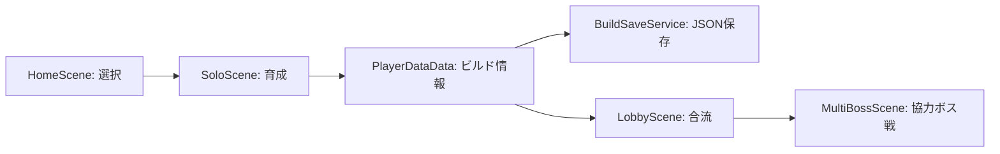
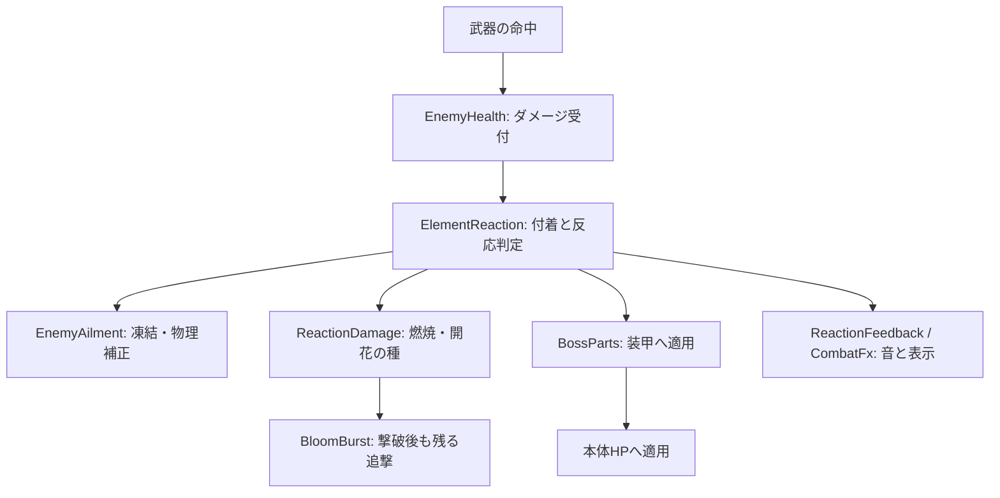
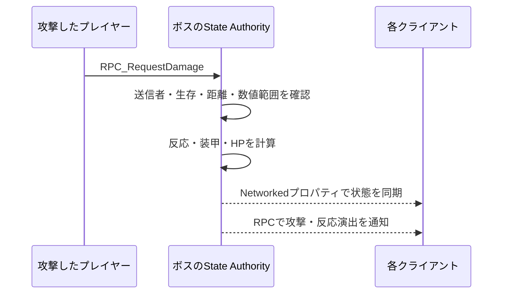

# 設計・実装の見どころ

[作品紹介へ戻る](../README.md) · [起動方法](GETTING_STARTED.md) · [全スクリプトの役割](スクリプト役割一覧.md)

ゲーム進行、戦闘ルール、通信、演出を複数のコンポーネントへ分割しています。以下は現在のコードを読むための案内です。全機能を疎結合にできているわけではなく、GameManagerやEffectsServiceには共有インスタンスへの依存が残っています。

## 1. ソロの成果をボス戦へ持ち込む

[GameManager](../Assets/RogueSurvivors/Scripts/GameManager.cs)がモード・時間・遷移を管理し、[PlayerStats](../Assets/RogueSurvivors/Scripts/PlayerStats.cs)から[PlayerDataData](../Assets/RogueSurvivors/Scripts/PlayerDataData.cs)へ状態を取り出します。[BuildSaveService](../Assets/RogueSurvivors/Scripts/BuildSaveService.cs)がデータ検証とJSONの読み書きを担当します。

保存時は一時ファイルへ書いてから既存ファイルを置換し、バックアップを残します。保存に失敗してもメモリ上のビルドを保持して遷移する処理があります。これはシーン上のオブジェクトをそのまま保存する構成ではありません。

## 2. 属性の組み合わせを戦闘へ変換する

図は主要な責務の関係です。装甲が攻撃を吸収した場合は本体HPを減らさず、追加効果にも装甲判定があります。

| クラス | 責務 |
|---|---|
| [ElementReaction](../Assets/RogueSurvivors/Scripts/ElementReaction.cs) | 付着属性、反応の組み合わせ、再発動待ち時間 |
| [ReactionBalance](../Assets/RogueSurvivors/Scripts/ReactionBalance.cs) | 反応の基準威力・倍率・表示名 |
| [ReactionDamage](../Assets/RogueSurvivors/Scripts/ReactionDamage.cs) | 燃焼の周期、開花の種、3属性への派生 |
| [BloomBurst](../Assets/RogueSurvivors/Scripts/BloomBurst.cs) | 敵の破棄と切り離した追撃。超開花の標的が倒れた場合は近くの敵を再選択 |
| [ReactionFeedback](../Assets/RogueSurvivors/Scripts/ReactionFeedback.cs) | 反応名・数字・音。短時間の連発を抑制 |

**改善例：倒した瞬間に反応が消える問題。** 種を敵に付けるだけでは、敵オブジェクトの破棄と同時に追撃も消えます。独立したBloomBurstに次フレームの追撃を任せ、撃破後も効果を完結させています。追加ダメージから新たな種を作らず、再帰的な連鎖を防いでいます。

**調整例：多段攻撃の反応が弱い問題。** 小さな命中ダメージだけに依存しない基準威力を設け、反応の共通待ち時間を通常敵0.18秒・ボス0.3秒へ変更しました。拡散は別の時計を使い、付着を消費せず支援に徹します。数値と測定条件は[火力調整の記録](属性反応と物理の火力・手応え.md)にまとめています。

## 3. 部位破壊を攻撃パターンへつなぐ

[BossParts](../Assets/RogueSurvivors/Scripts/BossParts.cs)が四方向の装甲と破壊順を持ち、[BossAttackDirector](../Assets/RogueSurvivors/Scripts/BossAttackDirector.cs)・[BossAttackRoutes](../Assets/RogueSurvivors/Scripts/BossAttackRoutes.cs)がボス種・形態・破壊状態に応じた行動を扱います。[BossBreakReward](../Assets/RogueSurvivors/Scripts/BossBreakReward.cs)は破壊後の攻撃機会を担当します。

破壊は攻略の進捗になる一方、ボスを強化します。部位ピンと短時間の弱点を組み合わせ、「どこを先に壊すか」「いつ近づくか」を判断する構造です。詳細は[部位戦術ガイド](部位ピンと破壊チャンス.md)にあります。

## 4. 協力プレイの状態管理

Photon Fusionの**Shared Mode**を使っています。ボスのState Authority（そのオブジェクトの状態を更新する権限）を持つクライアントが、命中要求を受けてHP・部位・形態を更新します。

入口は[NetworkEnemySync](../Assets/RogueSurvivors/Scripts/NetworkEnemySync.cs)です。プレイヤー生成は[NetworkPlayerSpawner](../Assets/RogueSurvivors/Scripts/NetworkPlayerSpawner.cs)、参加・退出・シーン遷移は[NetworkManager](../Assets/RogueSurvivors/Scripts/NetworkManager.cs)に分けています。

入力値のチェックはありますが、攻撃値はクライアントから申告される構成です。専用サーバーによる完全な再計算や、不正対策を実現した構成ではありません。現在の実証範囲は2クライアントで、最大4人の設定とは区別しています。

## 5. 調整結果を再確認できるようにする

- [RogueSmokeTests](../Assets/RogueSurvivors/Scripts/RogueSmokeTests.cs)と[ReactionImpactTests](../Assets/RogueSurvivors/Scripts/ReactionImpactTests.cs)：PlayModeで条件を作り、保存・戦闘・反応などのチェック結果をJSONへ出力。
- [BossBalanceProbe](../Assets/RogueSurvivors/Scripts/BossBalanceProbe.cs)：16・32・48強化分の構成で装甲・本体の火力を比較し、4種類のボス戦も自動実行。
- [CombatBalanceProbe](../Assets/RogueSurvivors/Scripts/CombatBalanceProbe.cs)：実際の敵生成、移動、経験値回収、3択を使い、5キャラクター×2シードを比較。

同じ48強化分の静止本体テストでは、物理合体を約921から約1,607ダメージ/秒へ調整しました。比較した属性構成は約1,467〜1,716です。ただし回避や接近の損失を含まない測定なので、これだけで実戦の公平性は証明できません。自動ソロではメイジの生存力に課題が残ることも、[結果とともに記録](属性反応と物理の火力・手応え.md)しています。

## ディレクトリの入口

| 場所 | 内容 |
|---|---|
| `Assets/RogueSurvivors/Scripts` | ゲーム本体、UI、通信、開発用の検証・撮影 |
| `Assets/RogueSurvivors/Editor` | セットアップ、検証起動、Windowsビルド |
| `Assets/RogueSurvivors/Scenes` | HomeScene / SoloScene / LobbyScene / MultiBossScene |
| `Assets/RogueSurvivors/Resources` | Prefab、画像、実行時リソース |
| `Packages` / `ProjectSettings` | パッケージ、タグ・レイヤー・衝突・ビルド設定 |
| `docs/検証データ` | 保存した検証結果。CIの自動更新ではありません |
